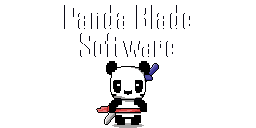

# Mini Mining

A relaxing idle mining game. Do other things then come back and see how your little friends are doing. Or keep them off to the side and interact as you go.

---

### Implementation Progress
| Item | Notes | Status |
|----------|:-------------:|------:|
| ~~Place items~~ | N/A | Done |
| ~~Ensure placement can't overlap~~ | N/A | Done |
| ~~Resize game window~~ | N/A | Done |
| ~~Move game window when borderless~~ | N/A | Done |
| ~~Mine materials~~ | N/A | Done |
| ~~Offload materials~~ | N/A | Done |
| Mineral smelting | N/A | Not Started |
| Power creation | N/A | Not Started |
| Power consumption | N/A | Not Started |
| User interface | N/A | Not Started |
| Purchase of items | N/A | Not Started |
| Research (Progression?) | N/A | Not Started |
| Upgrades - mining and collection | N/A | Not Started |
| Upgrades - power | N/A | Not Started |
| Rotate placements | N/A | Not Started |
| ... | ... | ... |

---

## Random Ideas

- Extra layer as a bar driven by profits of the mining
    - It has the ability to make drinks and upgrade over time

## Developed By

    

